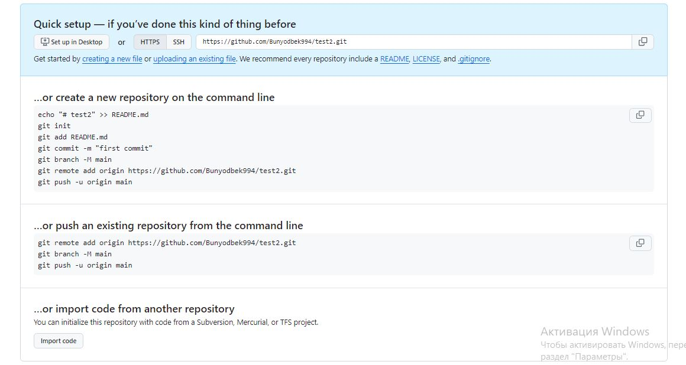

# Gitni githubga ulash

## Gitni ulashdan oldin vetka nomini master dan - main ga o'zgartirib olish kerak.
O'zgartirish:
```sh
git branch -M <vetka_nomi>
```
ulash uchun ketma ket qadamlar:

```sh
1. git remote add origin https://github.com/Bunyodbek994/test2.git

2. git push -u origin main
```




# Gitni GitHubdan uzish

```sh
git remote remove origin
```

# Gitni GitHubga ulangan adresini almashtirish

## Gitni bir repozitoriyadan boshqa bir repazitoriyaga to'g'ridan-to'g'ri almashtirish yoki ulash
```sh
git remote set-url origin https://github.com/Bunyodbek994/test2.git
```

# Git qaysi repozitoriyaga ulanganini ko'rish

## Qisqacha ko'rish
```sh
git remote -v 
```

## To'liq ko'rish

```sh
git remote show origin
```

# Git clone

## GitHub dan git clone yordamida kerakli repozitoriyani localga yuklab olish
```sh
git clone https://github.com/Bunyodbek994/test2.git
```

# GitHub dagi vetkani VS Code terminalidan foydalanib buyruq yordamida o'chirish
```sh
git push origin --delete <vetka_nomii>
```